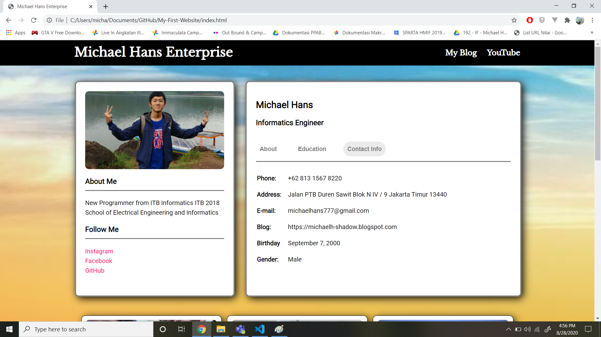

# My-First-Website
My First Website adalah proyek pribadi yang dibuat untuk memenuhi tugas IF3110 Pengembangan Aplikasi Berbasis Web. Website ini dibuat dengan menggunakan HTML, CSS, dan JavaScript.

## How to Use
Jalankan langsung index.html pada repository ini pada browser. Tidak perlu menginstall apapun.

## Tampilan Website
Berikut ini adalah tampilan dari website mengenai profil diri pembuat website.

## Author
- Nama	: Michael Hans
- NIM	: 13518056
- Kelas	: K-02